https://www.youtube.com/watch?v=RB8yw2nzA2Q
# AWS HOTEL CHATBOT

## Contenidos

### Configuración en AWS

#### 1. Configuración del chatbot

- Creamos un nuevo chatbot en blanco y añadimos el nombre.
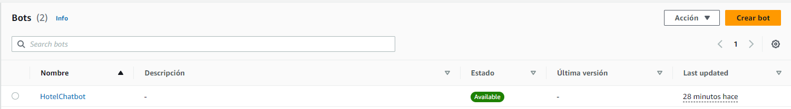

- Activamos los permisos correspondientes.
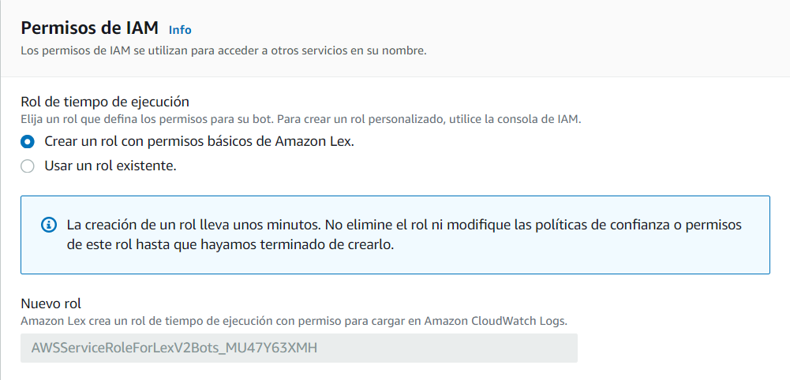

- Campo obligatorio de Ley de Protección de la Privacidad Infantil en Internet 
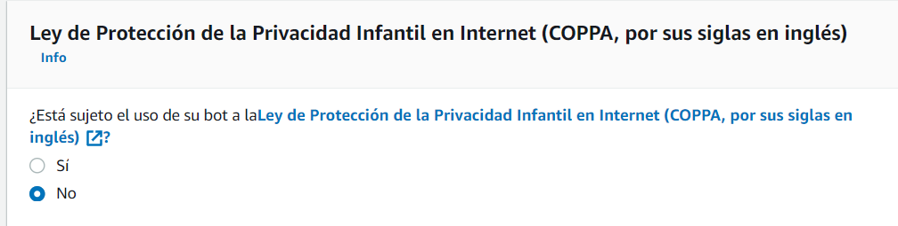

- Configuración del idioma. En nuestro caso, español e inglés.
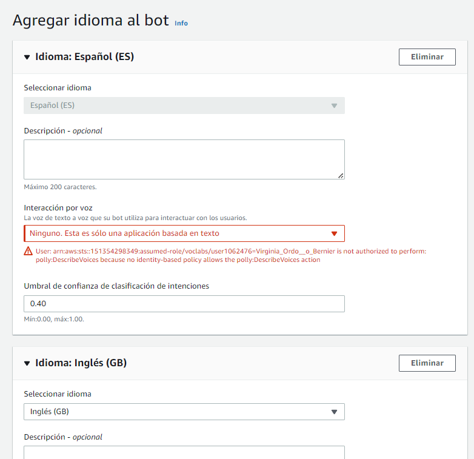

#### 2. Intents
- Creamos los _intents_ que consideremos. 
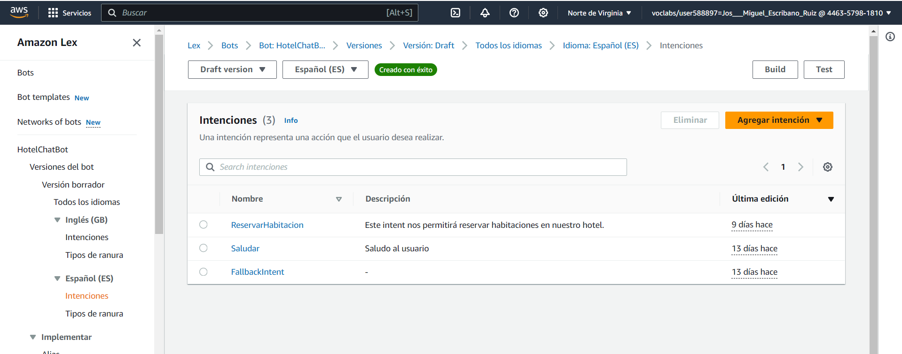

- Añadimos respuesta inicial.
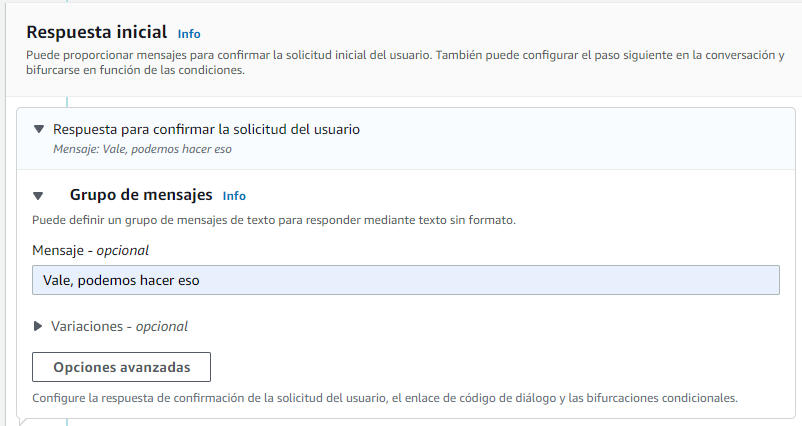

- Agregamos todos los enunciados que están relacionados con ese _intent_. 
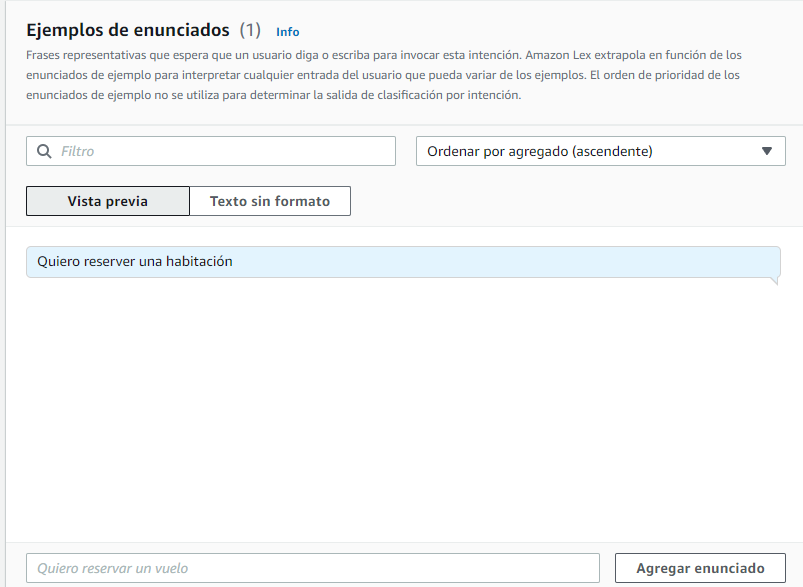

- En algunos casos usaremos _slots_ para definir parámetros como ciudades, cantidades, etc. 
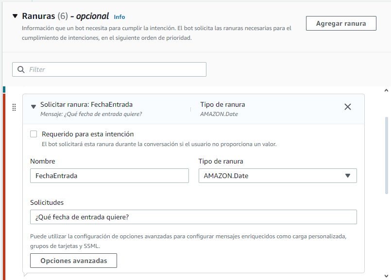

- Incluiremos esos slots en algunos de nuestros enunciados. 

- Configuramos mensajes de confirmación
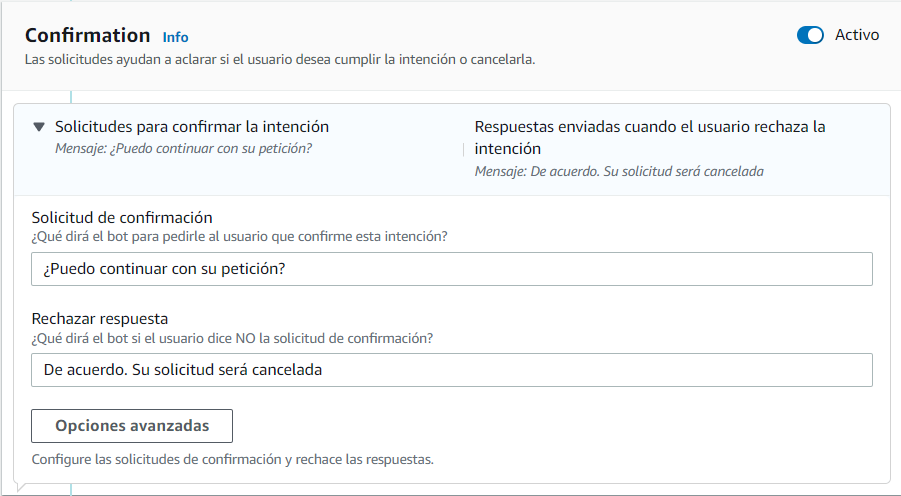

- Configuramos el mensaje de cierre
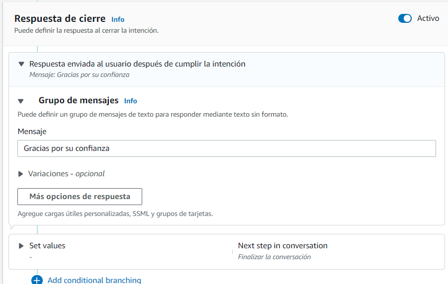

#### 3. Tipos de Slots

- Configuramos aquellos slots que tienen diferentes tipos, como es el caso del tipo de habitación
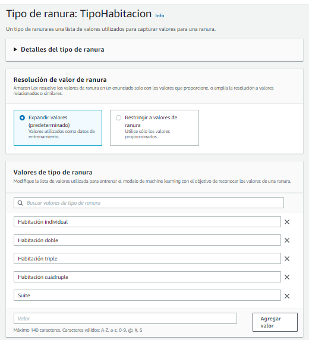

- En este caos volvemos a la página inicial de slots, e incluimos el tipo generado anteriormente
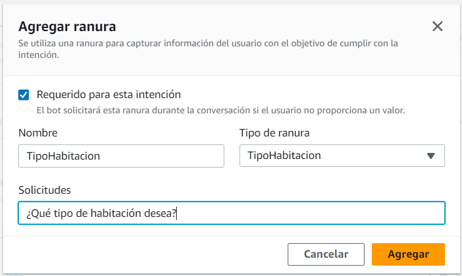