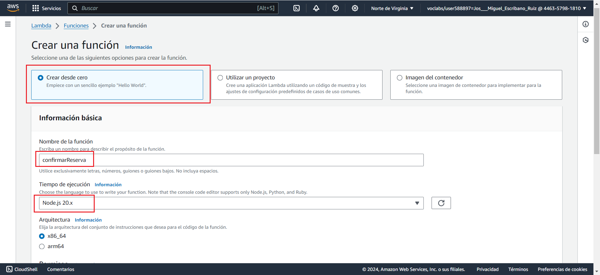

https://www.youtube.com/watch?v=RB8yw2nzA2Q
# AWS HOTEL CHATBOT

## Contenidos

### Configuración en AWS

#### 1. Configuración del chatbot

- Creamos un nuevo chatbot en blanco y añadimos el nombre.
  

- Activamos los permisos correspondientes.
  

- Campo obligatorio de Ley de Protección de la Privacidad Infantil en Internet 
  

- Configuración del idioma. En nuestro caso, español e inglés.
  

#### 2. Creación de los Intents

- Creamos los _intents_ que consideremos. 
  

- Añadimos respuesta inicial.
  

- Agregamos todos los enunciados que están relacionados con ese _intent_. 
  

- En algunos casos usaremos _slots_ para definir parámetros como ciudades, cantidades, etc.
   

- Incluiremos esos slots en algunos de nuestros enunciados.
   

- Configuramos mensajes de confirmación.
  

- Configuramos el mensaje de cierre.
  

#### 3. Tipos de Slots hay que revisarlo posiblemente haya que borrar.

- Configuramos aquellos slots que tienen diferentes tipos, como es el caso del tipo de habitación.
  

- En este caos volvemos a la página inicial de slots, e incluimos el tipo generado anteriormente.
  

## TODO

#### 4. Creación de los formularios.

- Añadir fórmularios nº de personas por habitación, añadir calendarios para fecha_entrada y salida y añadir cierre de confirmación de reserva y añadir lambda para confirmar la reserva.

**Implementación del formulario.** falta revisar fechas

Deberemos de elegir la ranura tipo de habitación y añadir el tipo de habitación que queremos que se muestre en el formulario.

Elegimos opciones avanzadas.

#### 5. Creación de la Lambda para la confirmación de la reserva.

- Creamos una nueva función Lambda.

**crear intent pagar habitación**
**revisar confirmación y cumplimiento**
**lambda para la confirmación de la reserva** hecho
**especificar formato fecha YYYY-MM-DD**
**buscar inglés**