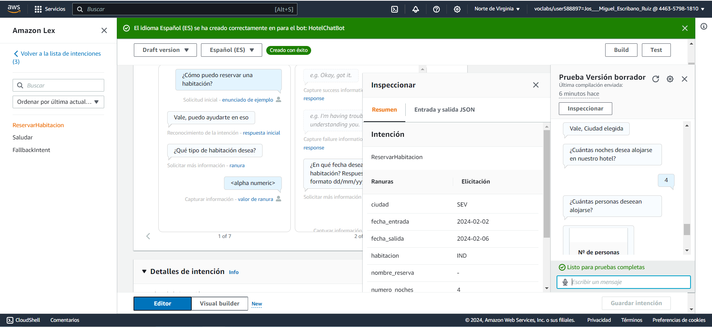

# Proyecto AWS HOTEL CHATBOT

## Autores

### **Virginia Ordoño Bernier**
### **José Miguel Escribano Ruiz**

### **Módulo: Modelos de Inteligencia Artificial**

    

## Contenidos

[Video Referencia](https://www.youtube.com/watch?v=RB8yw2nzA2Q), en el que nos hemos basado para la realización de este proyecto.

## Objetivos

El objetivo de este RA es que el alumnado adquiera parte de las competencias básicas del módulos "Modelos de Inteligencia Artificial" del Curso de Especialización en Inteligencia Artificial y Big Data.

Consistirá en desarrollar un chatbot desplegado y funcional que pueda gestionar reservas de hoteles y servicios adicionales de manera efectiva. Además, se espera un informe detallado que documente el proceso de desarrollo, las decisiones de diseño, las pruebas realizadas y las lecciones aprendidas.

Este proyecto no solo proporcionará a los estudiantes habilidades técnicas en el uso de AWS Lex, sino que también les permitirá explorar aspectos éticos y legales en el desarrollo de soluciones de inteligencia artificial.

## Introducción

El proyecto consiste en la creación de un chatbot que permita a los usuarios realizar reservas de habitaciones de hotel, con datos tales como la fecha de entrada y salida, el número de habitaciones, el tipo de habitación, etc. Además, el chatbot deberá ser capaz de responder a preguntas frecuentes y proporcionar información sobre los servicios del hotel.

## Objetivos del proyecto

- Crear un chatbot funcional que permita a los usuarios realizar reservas de habitaciones de hotel.
- Desplegar el chatbot en AWS Lex.
- Documentar el proceso de desarrollo, las decisiones de diseño, las pruebas realizadas y las lecciones aprendidas.
- Explorar aspectos éticos y legales en el desarrollo de soluciones de inteligencia artificial.
- Adquirir competencias básicas del módulo "Modelos de Inteligencia Artificial" del Curso de Especialización en Inteligencia Artificial y Big Data.

## ¿Por qué es importante este proyecto?

Los chatbots son una herramienta cada vez más común en el mundo de los negocios. Permiten a las empresas automatizar tareas repetitivas, mejorar la atención al cliente y ofrecer servicios personalizados. Además, los chatbots pueden ser una forma eficaz de recopilar datos sobre los clientes y sus preferencias.

## Metodología

El proyecto se desarrollará siguiendo la metodología de desarrollo de software ágil. Se utilizará un enfoque iterativo e incremental, con el fin de obtener retroalimentación temprana y mejorar continuamente el chatbot.

## Planificación

El proyecto se desarrollará en varias fases, que se detallan a continuación:

## Desarrollo del proyecto

### Configuración en AWS

#### 1. Creación del chatbot

- Creamos un nuevo chatbot en blanco y añadimos el nombre.
  

- Creamos los permisos correspondientes.
  

- Campo obligatorio de Ley de Protección de la Privacidad Infantil en Internet. En nuestro caso, no es necesario.
  

- Configuración del idioma. En nuestro caso, español e inglés.
  

#### 2. Creación de los Intents

- Creamos los _intents_ que consideremos. En nuestra caso hemos creado ReservarHabitacion, Saludar.
  

- Añadimos respuesta inicial.
  

- Agregamos todos los enunciados que están relacionados con ese _intent_. 
  

- En algunos casos usaremos _slots_ para definir parámetros como ciudades, cantidades, etc.
   

- Hemos creado 7 ranuras: tipo de habitación, fecha de entrada, fecha de salida, número de habitaciones, número de personas, ciudad y nombre de la reserva.

- Incluiremos esos slots en algunos de nuestros enunciados.
   

- Configuramos mensajes de confirmación.
  

- Configuramos el mensaje de cierre.
  

#### 3. Tipos de Slots hay que revisarlo posiblemente haya que borrar.

- Configuramos aquellos slots que tienen diferentes tipos, como es el caso del tipo de habitación.
  

- En este caso volvemos a la página inicial de slots, e incluimos el tipo generado anteriormente.
  

#### 4. Creación de los formularios.

- Añadir fórmularios nº de personas por habitación, añadir calendarios para fecha_entrada y salida y añadir cierre de confirmación de reserva y añadir lambda para confirmar la reserva.

Deberemos de elegir la ranura tipo de habitación y añadir el tipo de habitación que queremos que se muestre en el formulario.

Elegimos opciones avanzadas y dentro de ahí elegimos más opciones de mensaje.

- Agregamos grupo de tarjetas para el formulario.

- Ponemos todos lo inputs que queramos con Título del botón y valor del botón, este valor es el valor que se pondrá en el formulario cuando el usuario pulse la opción.

- Actualizamos y volvemos a construir el bot. Podemos observar que el formulario funciona bien, como se ve en la imagen siguiente.

#### 5. Creación de la Lambda para la confirmación de la reserva.

- Creamos una nueva función Lambda, esta lambda se creará para que haga una recopilación de las opciones que ha ido eligiendo el usuario para que la tenga al final de la reserva, con lo que ha ido seleccionando.

- Elegimos rol existente. En nuestro caso el rol es **"LabRole"**.

- Elegiremos node para crear la lambda.

- Añadimos el código de la lambda.

- Añadimos el nombre de la función y la descripción.

- Elegimos **"TestBotAlias"**.

- Elegimos el idioma de la lambda.

- Elegimos nuestra función lambda, y versión $LATEST y guardamos.

- Se lo asignamos al cumplimiento de la resreva del hotel.

Y ya estará creada y asignada la lambda, para recopilar los datos de la reserva, ahora sólo faltaría probarlo.

# TODO 2

### Realiazación de pruebas

En este apartado se realizarán pruebas para comprobar que el chatbot funciona correctamente. Se probarán diferentes escenarios y se documentarán los resultados.

### Pruebas de funcionalidad

#### 1. Prueba de saludo

Se prueban varios salidos y vemos que el chatbot responde correctamente.

#### 2. Prueba de reserva de habitación

Se prueban diferentes escenarios de reserva de habitación y se comprueba que el chatbot responde correctamente. Se harán diferentes preguntas cómo: nº de habitaciones, nº de personas, fecha de entrada y salida, tipo de habitación, etc.

- **crear intent pagar habitación**

- **revisar confirmación y cumplimiento con la función lambda** ✅

- **lambda para la confirmación de la reserva** ✅

- **especificar formato fecha YYYY-MM-DD tanto en salida como en entrada** ✅ puesto en el formulario que tiene que introducir fecha formato dd/mm/yyyy

- **buscar inglés**