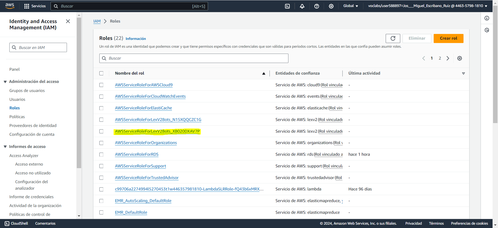

# AWS HOTEL CHATBOT - Reservas de Hotel 

    

## Índice

- **[Descripcion](#Descripción)**
- **[Objetivo](#Objetivo)**
- **[Fuentes](#Fuentes)**
- **[Planificación](#Planificación)**
- **[Tecnologías utilizadas](#Tecnologías-utilizadas)**
- **[Requisitos previos](#Requisitos-previos)**
- **[Licencia](#Licencia)**
- **[Autores](#Autores)**
- **[Desarrollo del proyecto](#Desarrollo-del-proyecto)**
  - **[Configuración en AWS](#Configuración-en-AWS)**
  - **[Realiazación de pruebas](#Realiazación-de-pruebas)**
  - **[Implementación del chatbot en una página web](#Implementación-del-chatbot-en-una-página-web)**
  - **[Pruebas de funcionalidad](#Pruebas-de-funcionalidad)**
    - **[Prueba de saludo](#Prueba-de-saludo)**

### Descripción

Este proyecto crea un chatbot que permite a los usuarios realizar reservas de habitaciones de hotel. El chatbot está desarrollado utilizando AWS Lex y se integra con otros servicios de AWS como Lambda. El proyecto forma parte del módulo **"Modelos de Inteligencia Artificial"** del Curso de **Especialización en Inteligencia Artificial y Big Data**.

### Objetivo

El chatbot puede ser utilizado por los hoteles para ofrecer un servicio de atención al cliente más eficiente y mejorar la experiencia de los usuarios. Los usuarios pueden utilizar el chatbot para realizar reservas de habitaciones, obtener información sobre los servicios del hotel y hacer preguntas frecuentes.

### Fuentes

- [How to Make a Chatbot Using Amazon Lex and AWS Lambda (Python)](https://www.youtube.com/watch?v=RB8yw2nzA2Q) -> en el que nos hemos basado para la realización de este proyecto.
- [Interact with an Amazon Lex V2 bot with the AWS CLI, AWS SDK for Python (Boto3), and AWS SDK for DotNet](https://aws.amazon.com/es/blogs/machine-learning/interact-with-an-amazon-lex2v2-bot-with-the-aws-cli-aws-sdk-for-python-and-aws-sdk-dotnet/)
- [Curso de AWS Desde Cero | Amazon Web Services](https://www.youtube.com/watch?v=zQyrhjEAqLs)
- [AWS LEX - Build & Deploy Chatbots (A Crash Course](https://www.youtube.com/watch?v=82WduX8A99g)
- [Building a Menu-Based Chatbot using Amazon Lex](https://www.youtube.com/watch?v=NVs1Y2MrZSA)
- [Learn About New Amazon Lex Features to Accelarate Customer Time to Value- AWS Online Tech Talks](https://www.youtube.com/watch?v=t5prCwYTdT0)
- [Usar el generador visual de conversaciones](https://docs.aws.amazon.com/es_es/lexv2/latest/dg/visual-conversation-builder.html)
- [Amazon Lex: Validate Slot data with Lambda](https://www.youtube.com/watch?v=1xRl8Ipa018)

### Planificación

El proyecto se desarrollará en las siguientes fases:

**Fase 1:** Diseño del chatbot

**Fase 2:** Desarrollo del chatbot

**Fase 3:** Pruebas del chatbot

**Fase 4:** Despliegue del chatbot

### Tecnologías utilizadas:

- **AWS Lex**
- **AWS Lambda**
- **Node.js**

### Requisitos previos:

- Tener una cuenta de AWS
- Tener conocimientos básicos de AWS Lex
- Tener conocimientos básicos de JavaScript.

[subir](#Índice)

### Licencia:

Este proyecto está licenciado bajo la licencia MIT.

### Autores:

- [José Miguel Escribano Ruiz](https://github.com/JMER15)

- [Virginia Ordoño Bernier](https://github.com/viorbe20)

## Desarrollo del proyecto

### Configuración en AWS

#### 1. Creación del chatbot

- Creamos un nuevo chatbot en blanco y añadimos el nombre.
  

- Creamos los permisos correspondientes.
  

- Campo obligatorio de Ley de Protección de la Privacidad Infantil en Internet. En nuestro caso, no es necesario.
  

- Configuración del idioma. En nuestro caso, español e inglés.
  

#### 2. Creación de los Intents

- Creamos los _intents_ que consideremos. En nuestra caso hemos creado ReservarHabitacion, Saludar.
  

- Añadimos respuesta inicial.
  

- Agregamos todos los enunciados que están relacionados con ese _intent_. 
  

- En algunos casos usaremos _slots_ para definir parámetros como ciudades, cantidades, etc.
   

- Hemos creado 7 ranuras: tipo de habitación, fecha de entrada, fecha de salida, número de habitaciones, número de personas, ciudad y nombre de la reserva.

- Incluiremos esos slots en algunos de nuestros enunciados.
   

- Configuramos mensajes de confirmación.
  

- Configuramos el mensaje de cierre.
  

#### 3. Tipos de Slots hay que revisarlo posiblemente haya que borrar.

- Configuramos aquellos slots que tienen diferentes tipos, como es el caso del tipo de habitación.
  

- En este caso volvemos a la página inicial de slots, e incluimos el tipo generado anteriormente.
  

#### 4. Creación de los formularios.

- Añadir fórmularios nº de personas por habitación, añadir calendarios para fecha_entrada y salida y añadir cierre de confirmación de reserva y añadir lambda para confirmar la reserva.

Deberemos de elegir la ranura tipo de habitación y añadir el tipo de habitación que queremos que se muestre en el formulario.

Elegimos opciones avanzadas y dentro de ahí elegimos más opciones de mensaje.

- Agregamos grupo de tarjetas para el formulario.

- Ponemos todos lo inputs que queramos con Título del botón y valor del botón, este valor es el valor que se pondrá en el formulario cuando el usuario pulse la opción.

- Actualizamos y volvemos a construir el bot. Podemos observar que el formulario funciona bien, como se ve en la imagen siguiente.

#### 5. Creación de la Lambda para la confirmación de la reserva.

- Creamos una nueva función Lambda, esta lambda se creará para que haga una recopilación de las opciones que ha ido eligiendo el usuario para que la tenga al final de la reserva, con lo que ha ido seleccionando.

- Elegimos rol existente. En nuestro caso el rol es **"LabRole"**.

- Elegiremos node para crear la lambda.

- Añadimos el código de la lambda.

- Añadimos el nombre de la función y la descripción.

- Elegimos **"TestBotAlias"**.

- Elegimos el idioma de la lambda.

- Elegimos nuestra función lambda, y versión $LATEST y guardamos.

- Se lo asignamos al cumplimiento de la resreva del hotel.

Y ya estará creada y asignada la lambda, para recopilar los datos de la reserva, ahora sólo faltaría probarlo.

# TODO 2

### Realiazación de pruebas

En este apartado se realizarán pruebas para comprobar que el chatbot funciona correctamente. Se probarán diferentes escenarios y se documentarán los resultados.

### Pruebas de funcionalidad

#### 1. Prueba de saludo

Se prueban varios salidos y vemos que el chatbot responde correctamente.

#### 2. Prueba de reserva de habitación

Se prueban diferentes escenarios de reserva de habitación y se comprueba que el chatbot responde correctamente. Se harán diferentes preguntas cómo: nº de habitaciones, nº de personas, fecha de entrada y salida, tipo de habitación, etc.

### Implementación del chatbot en una página web

#### 1. Creación de la página web

- Creamos una página web sencilla con HTML y CSS.
- Añadimos el código de AWS Lex para integrar el chatbot en la página web.
- Subimos la página web a un servidor.
- Probamos la página web y comprobamos que el chatbot funciona correctamente.
- Documentamos el proceso de integración del chatbot en la página web.

Para ello usaremos esta página que nos permite alojar páginas web gratuitamente.

- [kommunicate](https://www.kommunicate.io/)

Nos registramos con nuestro correo y elegimos el rol de estudiante.

Seleccionamos la opción de integración de chatbot.

Elegimos la opción Bot Integrations para integrar nuestro bot. Tenemos varias formas de integrarlo como por ejemplo AWS que será nuestra opción, también tenemos DialogFlow ES, OpenAi entre otras.

Seleccionamos AWS

Seleccionamos AWS Lex v2

Necesitaremos una access key y una secret key que nos proporcionara AWS.

Para ello deberemos de ir a IAM y ver el rol asignado y de ahí sacamos la access key y la secret key.

En nuestro caso este es el rol que se le asigno al crear nuestro rol, porque se le asigno el rol de LabRole.

- **revisar confirmación y cumplimiento con la función lambda** ✅

- **lambda para la confirmación de la reserva** ✅

- **especificar formato fecha YYYY-MM-DD tanto en salida como en entrada** ✅ puesto en el formulario que tiene que introducir fecha formato dd/mm/yyyy

- **¿Implementar ingles?**
- 
- **Sugerencia actividades**